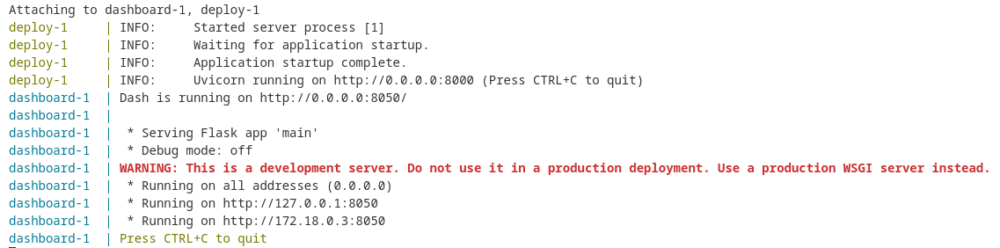
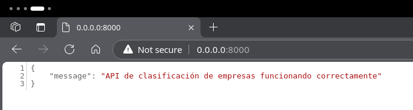
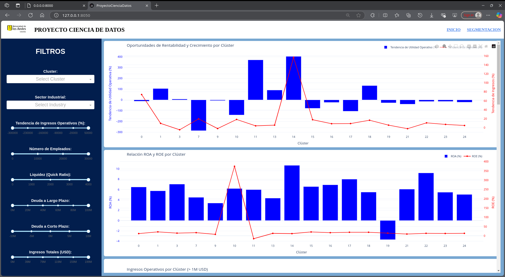
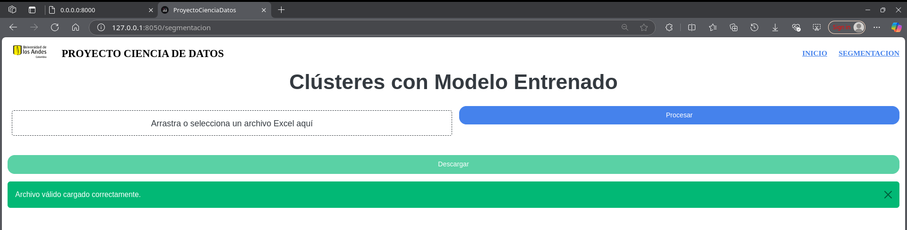
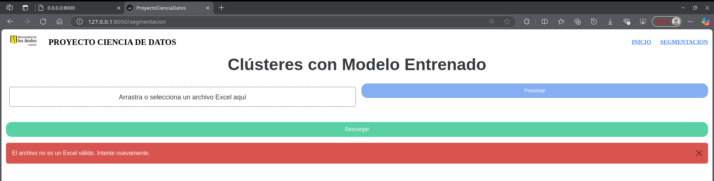
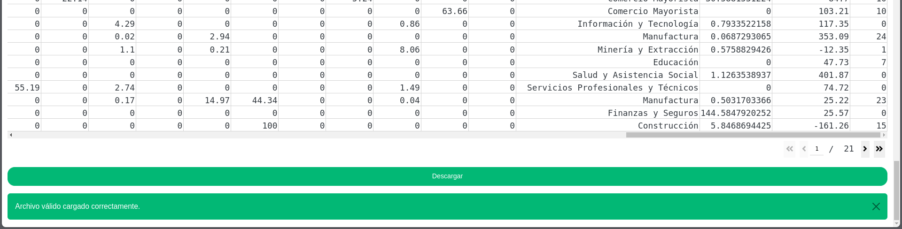
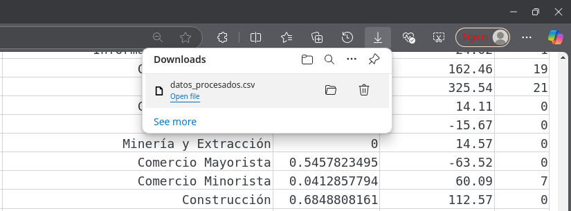

# SEGMENTACIÓN DE COMPAÑIAS

Este repositorio contiene el análisis y procesamiento de 10.000 registros de compañías de Bogotá.

Se busca explorar y segmentar compañías según distintos factores financieros y de rentabilidad.

## Estructura del proyecto

```
.
├── compose.yaml
├── dashboard
│   ├── assets
│   │   └── styles.css
│   ├── callbacks
│   │   ├── calbback_industry_filter.py
│   │   ├── callback_cluster_filter.py
│   │   ├── callback_debtreduction_chart.py
│   │   ├── callback_highdebt_chart.py
│   │   ├── callback_liquidity_chart.py
│   │   ├── callback_operational_capacity_chart.py
│   │   ├── callback_opportunities_chart.py
│   │   ├── callback_revenue_chart.py
│   │   ├── callback_roaroe_chart.py
│   │   └── callback_sector_chart.py
│   ├── components
│   │   ├── charts
│   │   ├── filters
│   │   └── navbar.py
│   ├── config
│   │   └── config.py
│   ├── datos
│   │   └── complete_payload.json
│   ├── docker-compose.yaml
│   ├── Dockerfile
│   ├── main.py
│   ├── pages
│   │   ├── home.py
│   │   └── segmentacion.py
│   ├── requirements_dashboard.txt
│   └── utils
│       └── data_loader.py
├── deploy
│   ├── app.py
│   ├── compose.yaml
│   ├── DockerFile
│   ├── kmeans_model.joblib
│   ├── preprocessor.pkl
│   ├── preprocess_pipeline.py
│   └── requirements.txt
├── eda.ipynb
├── pipeline_data_preparation.ipynb
├── Proyecto_Entrega1.pdf
├── README.md
└── requirements.txt

12 directories, 34 files
```


** Los datos no estan incluidos en el repositorio, por políticas del proveedor **

## Participantes

- Juan Daniel Castrellón (201729285)
- Kevin Camilo Becerra Walteros (201812779) 
- Laura Andrea Roncancio Pava (201815149)
- Javier Alejandro Gómez Muñóz (201217975)
 

## Ejecución Notebooks

Para ejecutar los notebooks, instale las librerias de `.requirements.txt` en su ambiente de jupyter.

## Ejecución Producto de datos

Para ejecutar el producto, tanto el dashboard como la api, siga estos pasos:  

1. Valide que su version de docker compose sea mayor o igual a:

```
Docker Compose version v2.29.7
```
2. Ejecute, desde la ubicacion inicial `./`:

```
docker compose up
```

3. Si todo esta bien, debe ver algo similar en su terminal:



4. Al ir a la url del api, verá la salida:



4. Al ir a la url del dashboard, debe ver la salida inicial, donde puede usar los filtros y navegar sobre las gráficas:  



4. Para cargar un excel con nuevos datos a segmentar, use la url `http://127.0.0.1:8050/segmentacion`  

4.1 Cargue el archivo, extraido de Emis, en formato xlsx.  

4.1.1. Si el archivo es válido, encontrará una salida similar a la siguiente imagen despues de unos 5 segundos (Pase al paso 4.2.):  



4.1.2. Si el archivo no es válido, encontrara la salida de la siguiente imagen, y debe buscar un archivo válido:  



4.2. Pulse el boton de procesar y espere unos segundos, al final de la página encontrará algo similar, donde la última columna es el cluster:  



5. Descargue el archivo procesado:   




## Conclusiones iniciales

- Predominio de micro y pequeñas empresas: La industria de Bogotá está formada principalmente por empresas de menor escala (de 0 a 50 empleados). Esta característica podría ser un reflejo de la estructura empresarial de la ciudad, donde las micro y pequeñas empresas impulsan una parte significativa de la economía local.

- Concentración de las exportaciones: Un reducido número de empresas realiza entre el 80% y el 100% de las exportaciones de Bogotá. Este hallazgo sugiere que las exportaciones de la ciudad dependen principalmente de industrias específicas, lo cual representa tanto una fortaleza para dichas industrias como un riesgo potencial en caso de cambios en el mercado.

- Relación entre deuda y efectivo disponible: Se observó que las empresas con mayor deuda a largo plazo también tienden a tener mayores cantidades de efectivo disponible. Este patrón podría indicar que las empresas con mayor capacidad de financiamiento también cuentan con mejores recursos de liquidez para sus operaciones.

- Inversión en activos fijos y ventas totales: Existe una relación directa entre las inversiones en activos fijos, las ventas totales y la deuda a largo plazo. Esto sugiere que las empresas con mayores ventas y deuda invierten también en sus activos fijos, lo que probablemente les permite expandir y mejorar sus operaciones.

- Impacto de la deuda a corto plazo en el desempeño financiero: Las empresas con mayores niveles de deuda a corto plazo podrían mostrar un desempeño financiero distinto, especialmente en términos de crecimiento de ingresos y beneficios. Este comportamiento sugiere que la gestión de deuda a corto plazo es un factor clave en el rendimiento financiero de las empresas.

- Correlaciones financieras para agrupación: Las correlaciones entre las variables analizadas permiten trazar un perfil general de la salud financiera de las empresas. Estos resultados serán la base para el siguiente paso en el análisis: seleccionar el mejor modelo de agrupación para clasificar a las empresas en diferentes clústeres de acuerdo con su rendimiento y segmentación NAICS, lo que permitirá una segmentación más precisa para la prospección.

## Conclusiones finales

- Se cumplió el objetivo del proyecto ya que se realizó el dashboard para el análisis de los usuarios, donde se les facilita encontrar prospectos según los servicios que ofrecen y se logró hacer la clasificación de las 10.000 empresas de Bogotá por su clúster.
- Las mayores dificultades que se obtuvieron durante su desarrollo fueron que dada la diversidad de las empresas, una dificultad grande fue agruparlas con una buena métrica de silueta.
- El producto de datos contribuye a un aumento significativo al valor del negocio, esto ya que se estima que la tasa de oportunidades aumente en 30% a 40%, la tasa de interacción aumente en un 15% a 25% y el coste por lead calificado disminuya en 40% a 50%.
- Dado que las empresas no están obligadas a reportar sus datos financieros, hay algunos faltantes, aquí habría una oportunidad de mejora.
- El mejor modelo obtenido es suficiente para dar solución a la oportunidad del negocio.

